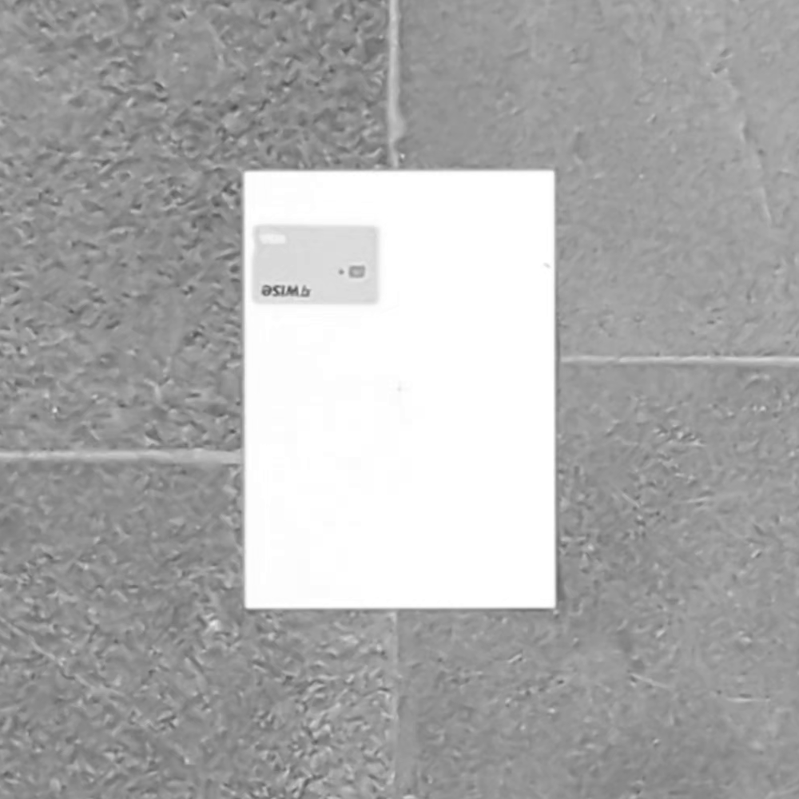
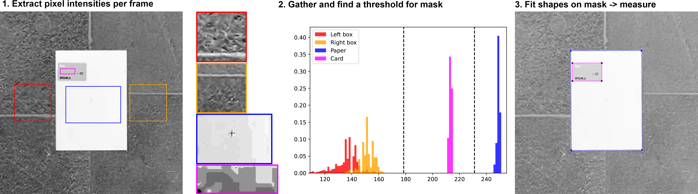

# Exercise2 - Cameras and Lenses


## Introduction

The purpose of this exercise is to use Python to calculate camera and scene specific values based on camera geometry in relation to the scene. In addition you will use an approximation to triangulation to calculate some theoretical values based on a constant working distance. Finally, you will demonstrate the principle of sub-pixel-precision.

## Learning Objectives

After completing this exercise, the student should be able to do the following:

- Create a Python function that uses the thin lens equation to compute either the focal length (f), where the rays are focused (b) or an object distance (g) when two of the other measurements are given
- Relate the physical dimensions of an object and the working distance to the image size on the sensor
- Understand the physical pixel resolution and relate it to the principle of sub-pixel accuracy. 


## Warming up

### Exercise 1

Explain how to calculate the angle $\theta$ when $a$ and $b$ is given
in the figure below. Calculate $\theta$ (in degrees) when
$a = 10$ and $b=3$ using the function `math.atan2()`. Remember to import `math` and find out what `atan2` does.


### Exercise 2

Create a Python function called `camera_b_distance`.

The function should accept two arguments, a focal length f and an
object distance g. It should return the distance from the lens to
where the rays are focused (b) (where the CCD should be placed)

The function should start like this:

```python
def camera_b_distance(f, g):
    """
    camera_b_distance returns the distance (b) where the CCD should be placed
    when the object distance (g) and the focal length (f) are given
    :param f: Focal length
    :param g: Object distance
    :return: b, the distance where the CCD should be placed
    """
```

It should be based on Gauss' lens equation:

$$\frac{1}{g} + \frac{1}{b} = \frac{1}{f}$$

You should decide if your function should calculate distances in mm or
in meters, but remember to be consistent!

Use your function to find out where the CCD should be placed when the
focal length is 15 mm and the object distance is 0.1, 1, 5, and 15
meters.

What happens to the place of the CCD when the object distance is increased?

## Case: sub-pixel precision experiment

In the following exercise, you should remember to explain when
something is in mm and when it is in meters. To convert between
radians and degrees you can use:

```
angle_degrees = 180.0 / math.pi * angle_radians
```

### Exercise 3: Amateur metrologists
Two amateur metrologists try to measure the physical dimensions of a piece of paper using a low-quality homemade experimental setup. A piece of A4 paper is placed directly below a stair-case on which a low quality CCD camera lies. The optical axis of the CCD camera is exactly aligned with the centre of the piece of paper. 


The front lens element of the camera is located 299.68m above the paper (i.e. $WD\approx2.9968 m$).

The height of the piece of paper is 290mm and is along the $y$-axis of the image. Similarly, the width is 210mm, and is along the $x$-axis of the image. 

The camera is the smartphone camera in a Google Pixel 7, and the camera used has the following table specifications: 

- 50 MP, 
- Image resolution: $8160\times6144$
- 24mm equivalent f/1.85-aperture - physical focal length ~ 6.8mm
- 82˚ field of view (wide)
- Pixel side length: 1.2 µm (also called pixel pitch)
- Resolution from video: $3840\times 2160$ pixels 
- Complete sensor size: $9.782\text{mm}\times 7.3728\text{mm} (12.26\text{mm} \text{ diagonal})$

Initially, the amateur metrologists start out with a single image of the scene. They try to verify whether they can utilize thin-lens theory, camera parameters and the object distance to measure the dimensions of the piece of paper correctly. 

**Preparation**: It is easiest to start by drawing the scene and the thin lens equation. The scene should contain the optical axis, the optical center, the lens, the focal
point, the CCD chip, the paper, and the variables for the thin lens equation. 

#### Excercise 3.1: 
A focused image of the paper is formed inside the camera. One of the metrologists measures the full image height of the paper in a frame to be 385 pixels. What is the equivalent height of the image in mm?
   
??? tip "Answer:" 
    $$B = \frac{385}{2} \cdot 1.2 \cdot 10^{-6} \text{m} = 2.31\cdot 10^{-4} \text{m}$$

#### Exercise 3.2 
At which distance to the lens is the image formed? 
    
??? tip "Answer:" 
    $$\frac{b}{B} = \frac{g}{G} \leftrightarrow b = \frac{g\cdot B}{G} = \frac{2.9968 \text{m}  \cdot 2.31\cdot 10^{-4}}{\frac{0.290}{2}\text{m}} = 4.77\cdot 10^{-3}\text{m}$$
 

#### Exercise 3.3 

What is the effective physical size of the active image region for this video?

??? tip "Answer:" 
    $$h_m \times w_m = 3840\cdot 1.2\cdot 10^{-6} m \times 2160\cdot 1.2\cdot 10^{-6}m = 4.61\cdot 10^{-3} \text{m} \times 2.59\cdot 10^{-3}\text{m}$$

#### Exercise 3.4
What is the effective horizontal FOV of the video, measured in degrees? 

??? tip "Answer:"
    $$f_h = 2\tan^{-1}\left(\frac{\frac{w_m}{2}}{f}\right)\frac{180}{\pi} = 2\tan^{-1}(\frac{\frac{2.59}{2}\cdot 10^{-3}\text{m}}{6.8\cdot 10^{-3}m})\cdot \frac{180}{\pi} = 21.6^{\circ}$$

#### Exercise 3.5
What is the effective vertical field of view of the video, measured in degrees? 

??? tip "Answer:"
    $$f_v = 2\tan^{-1}\left(\frac{\frac{h_m}{2}}{f}\right)\frac{180}{\pi} = 2\tan^{-1}(\frac{\frac{4.61}{2}\cdot 10^{-3}\text{m}}{6.8\cdot 10^{-3}m})\cdot \frac{180}{\pi} = 37.47^{\circ}$$

#### Exercise 3.6
1. Assume you exchange the paper with a credit card which has dimensions $85.60\times 53.98\text{ mm}$. How tall in pixels will the credit card be on the sensor, still assuming it is perfectly centered in the optical axis? 

??? tip "Answer:"
    First calculate the image distance using the thin lens formula: 

    $$\frac{1}{f}=\frac{1}{b}+\frac{1}{g}\leftrightarrow b = \frac{1}{\frac{1}{f}-\frac{1}{g}} = \frac{1}{\frac{1}{6.8\cdot 10^{-3}\text{m}} - \frac{1}{2.9968\text{m}}} = 6.82\cdot 10^{-3}\text{m}$$

    And now use this quantity to calculate the height from Eq. 2.3:

    $$B = \frac{bG}{g} = \frac{6.82\cdot 10^{-3}\text{m}\cdot 53.98\cdot 10^{-3}\text{m}}{2.9968\text{m}} = 1.22\cdot 10^{-4}\text{m}$$

    Finally, relate this to the number of pixels using the side-length of a pixel: 

    $$h_{pix} = \left\lceil \frac{B}{p} \right\rceil = \left\lceil \frac{1.22\cdot 10^{-4}\text{m}}{1.2\cdot 10^{-6}\text{m}}\right\rceil = \lceil 102.3 \rceil = 103$$

#### Exercise 3.7 
What physical distance in the object plane does a single pixel correspond to in this exact case?

??? tip "Answer:"
    We have the equation 

    $$B/p = 1 \rightarrow \frac{bG}{gp} = 1 \rightarrow G = \frac{g\cdot p}{b}$$ 
    
    so the following computation yields the pixel dimension:
    
    $$\frac{2.9968\text{m}\cdot 1.2\cdot 10^{-6}\text{m}}{6.82\cdot 10^{-3}\text{m}} = 5.28\cdot 10^{-4}\text{m}$$

    And in general for the setting where $g\gg f$, we may additionally use $b\approx f$. The approximation $b\approx f$ holds because the working distance is much larger than the focal length. In this regime, the thin-lens camera behaves like a pinhole camera with an effective focal length. This is why calibration procedures estimate camera parameters directly in pixel units rather than attempting to recover physical lens properties. 
    
    The result means that the camera setup from a single frame, disregarding noise and optic errors, is able to measure distances on a half millimeter scale. 


Now, in order to confirm the theory, the two amateur metrologists gather data with a credit card within the image frame, and try to measure its height and width in pixels. A cropped frame from the resulting image looks as presented in the Figure below: 
 

To measure the height and width, they load a single image frame from the experiment using matplotlib: 

```
import matplotlib.pyplot as plt 
from skimage.io import imread
im = imread("data/images/with_calib/crops/0.png",cmap="gray")
plt.imshow(im)
plt.show()
```

and inspect using the cursor how tall and wide the credit card is. 

#### Exercise 3.8
What is the width and height of the credit card approximately measured in pixels? Does it fit with the theoretical calculations? 

??? tip "Answer:"
    Measuring yields a width which is approximately: 

    $$W_{pix} \approx 473-315 = 158$$

    and a height: 

    $$H_{pix} \approx 381-282 = 99$$ 

    Which is quite close to the calculated theoretical value. Discrepancies may be caused by imprecise focal length, imprecised measured object distance and a slight rotation with respect to the sensor axes. In addition, the card is not in the optical center, which our calculations assume. **This is the exact reason why machine vision setups seldom rely on theoretical calculations, but rather use calibration, as you will see in exercise 5.xxx**. 

### Exercise 4 - coordinate frames and triangulation
#### Exercise 4.1
Continue assuming that the credit card is perfectly centered in the optical centre, and the camera is perfectly orthogonally oriented towards the scene. Express the camera-vectors of the top centre, bottom centre, left centre and right centre of the credit card in the camera-coordinate system when assuming that the object is perfectly planar. 

??? tip "Answer:"
    the camera vectors are: 

    $$\begin{pmatrix} -\frac{W_c}{2} \\ 0\\ Z \end{pmatrix}, \qquad \begin{pmatrix} \frac{W_c}{2} \\ 0\\ Z \end{pmatrix},\qquad \begin{pmatrix} 0 \\ -\frac{H_c}{2}\\ Z \end{pmatrix}, \qquad \begin{pmatrix} 0 \\ \frac{H_c}{2}\\ Z \end{pmatrix}$$
    
    which in this case yields:
    
    $$\begin{pmatrix} -4.33\cdot 10^{-2}\text{m} \\ 0\\ 2.9968\text{m} \end{pmatrix}, \qquad \begin{pmatrix} 4.33\cdot 10^{-2}\text{m} \\ 0\\ 2.9968\text{m} \end{pmatrix},\qquad \begin{pmatrix} 0 \\ -2.70\cdot 10^{-2}\\ 2.9968\text{m} \end{pmatrix}, \qquad \begin{pmatrix} 0 \\ 2.70\cdot 10^{-2}\\ 2.9968\text{m} \end{pmatrix}$$
    

#### Exercise 4.2
Now calculate the corresponding physical coordinates on the image sensor in the format $x,y,z$ using the triangulation approximation in Eq. 1 of the triangulation note. 

??? tip "Answer:"
    We have $z=f=6.8\cdot 10^{-3}m$. 
    We may use the similarity of triangles to calculate: 

    $$x' = \frac{f}{WD}x_c = \frac{6.8\cdot 10^{-3}\text{m}}{2.9968\text{m}}x_c, y' = \frac{f}{WD} = \frac{6.8\cdot 10^{-3}\text{m}}{2.9968\text{m}}y_c$$

    for each point. This yields:

    $$\begin{bmatrix}
    -9.81\cdot 10^{-5}\text{m} & 9.81\cdot 10^{-5}\text{m} & 0.00\text{m} & 0.00\text{m}\\
    0.00 \text{m} & 0.00 \text{m} & -6.12\cdot 10^{-5}\text{m} & 6.12\cdot 10^{-5}\text{m}\\
    6.8 \cdot 10^{-3}\text{m} & 6.8\cdot 10^{-3}\text{m} & 6.8\cdot 10^{-3}\text{m} & 6.8\cdot 10^{-3}\text{m}\\
    \end{bmatrix}$$ 
        
#### Exercise 4.3 
What is the corresponding height and width of the card on the sensor when using the triangulation? 
        
??? tip "Answer:"
    First, calculate the physical width and height on the sensor: 

    $$\Delta x = 9.81\cdot 10^{-05}\text{m}-(-9.81\cdot 10^{-05}\text{m})=19.6\cdot10^{-4}\text{m}, \Delta y = 6.12\cdot 10^{-5}\text{m}-(-6.12\cdot 10^{-5}\text{m})=1.22\cdot 10^{-4}\text{m}$$ 
    
    and divide each by the pixel pitch: 

    $$n_w = \frac{\Delta x}{p} = \frac{19.6\cdot10^{-4}\text{m}}{1.2\cdot 10^{-6}\text{m}} = 163.6, \qquad n_h = \frac{\Delta y}{p} = \frac{1.22\cdot 10^{-4}\text{m}}{1.2\cdot 10^{-6}\text{m}} = 102.1$$

#### Exercise 4.4
Relate the found values to the ones found in exercise 3.6. Are they similar? If you find a small difference, do you have an idea where it originates from? 
    
??? tip "Answer:"
    The difference arises because Exercise 6 uses the full thin-lens equation, whereas Exercises 9–11 use a pinhole (triangulation) approximation in which the image distance is assumed to be equal to the focal length. Since the working distance is large compared to the focal length ($g>gg f$), the relative error introduced by this approximation is very small, but still present. 
    If we used $b$ instead of $f$ for the imaging distance, we would recover exactly the same values. 

#### Exercise 4.5 (optional) 

Try and recompute the results from exercise 3.6 but using $b=f$. Try to relate your results to exercise 4.4. 
    
??? tip "Answer:"
    Now the two results are equivalent. This is because it is the same projective geometry; in essence, it is the same math, but written in two different coordinate frames. In 3.6 we compute the dimensions using lens-equations, i.e. we use a thin-lens model, whereas we in 4.1-4.3 use a pinhole camera. The thin-lens equation simply determines the image distance $b$, while triangulation describes how 3D points map to the image plane once $b$ is known. 
    
    Although the thin-lens model is physically more detailed, it is rarely used in the machine vision industry because the image distance $b$ cannot be recovered from images alone. This is due to the fact that $b$ is fundamentally entangled with the unknown (or variable) object distance. As a result, $b$ is not an observable quantity in projective imaging. 
    
    Computer vision therefore uses a pinhole model in which all internal camera geometry is absorbed into an effective focal length measured directly in pixel units. This directly translates to saying that lens thickness and internal structure are irrelevant for projective geometry, once the image is in focus and the working distance is large. 


### Exercise 5: Measuring with sub-pixel precision 
Due to the discrepancy found in exercise 3.8, the metrologists re-do the experiment, as they realize they cannot rely on thin-lens theory. As they only have a single camera, they can not triangulate their way out of their difficulties, and therefore they decide to use a ***calibration rod*** to infer the physical pixel size in the object plane. They decide to use a credit card, with dimensions $53.98\text{mm}\times 86.50\text{mm}$ for calibration. Therefore they place the card on top of the piece of paper, and again record a video. 

They record for approximately a minute, holding the camera as still as possible. The video is recorded at 24 fps, and in total they obtain 1466 frames. They followingly for each video frame: 
1. Crop the video 
2. Convert it to grayscale 
3. Save it as a .png file

Then, for each frame, the metrologists carry out steps which you will learn later in this course. Their procedure is as follows:

1. Calculate the intensity gradient along the x-dimension 
2. Per row of the intensity gradient, find the minimum and maximum peaks which are the paper boundaries 
3. Using the gradient values in the neighbourhood around the peak coordinate, compute the centroid coordinate
4. Filter the coordinates to remove misdetections
5. Make a regression on the remaining points. This gives a function for the left and right edge
6. From one edge, compute the orthogonal distance to the function describing the other edge

The complete process is outlined in the following Figure: 


The metrologists have saved all data extracted from the pipeline in the folder ***data/measurements/lstsq/*** as csv and .npy files. In each file, the recorded average value of the quantity of interest is saved per frame.   

#### Exercise 5.1
Load the widths and height measurements for the credit card and the piece of paper. 
??? tip "Tip:"
    You can use `np.loadtxt(<path_to_your_file>,delimiter=",")` to read a .csv file. 

#### Exercise 5.2
Compute the physical resolution of a pixel in $\frac{\text{mm}}{\text{pixel}}$ using the known size of the credit card. Do this in the x and y direction. 

??? tip "Tip:"
    We want the calibration element to be as precise and stable as possible. Therefore, we calculate the mean over it before the division. An underlying assumption here is that the camera lies still relatively to the paper: else a per-frame calibration should be carried out. 

#### Exercise 5.3 
Compute the sub-pixel estimate for the paper dimensions using all measured paper widths and the found calibration value. 

??? tip "Answer:"
    <!-- Using simple: $298.3\pm 0.012\text{mm}, 207.3 \pm 0.006 \text{mm}$  
    Using opencv2 rectangle: $293.5\pm 0.003\text{mm}, 212.6 \pm 0.002 \text{mm}$ (note much higher precision, but worse accuracy) -->
    We get $209.546\text{mm}$


#### Exercise 5.4
Make a loop and calculate statistics as a function of the number of samples used in the estimation of the paper dimensions. You can use the following as inspiration: 

```
Ns = np.arange(10, len(widths), 10)  # More points for smoother curve
# Calculate metrics correctly
width_means = []
width_sem = []  # Standard error of the mean
width_std_of_sample = []  # Sample standard deviation
for n in Ns:
    width_slice = widths[:n]
    ... your code to compute quantities here ...
    ... your code to append computed quantities to the lists ... 
```

In the loop you should: 
1. Estimate the mean width of the paper in pixels, using all samples up to n. 
2. Convert the mean to physical units using the earlier found calibration factor 
3. Save the standard-deviation of the individual measurements, using e.g. `width_std = width_slice.std(ddof=1)`
4. Compute the standard error of the mean using $SE=\frac{\sigma}{\sqrt{N}}$, or in code `width_std/np.sqrt(n)`. 
5. Save everything to the lists so we can plot it later. 

??? tip "Solution:"
    Something like the following does the trick: 

    ```
    for n in Ns:
        # Average pixel measurements
        width_slice = widths[:n]
        mean_paper_width_pixels = widths[:n].mean()
        # Apply calibration
        width_means.append(mean_paper_width_pixels * mm_per_pixel_w)
        # Sample standard deviation (of individual measurements)
        width_std = width_slice.std(ddof=1)
        width_std_of_sample.append(width_std)
        # Standard error of the mean = std / sqrt(n)
        width_sem.append(width_std / np.sqrt(n)) 
    ``` 

#### Exercise 5.5 
Demonstrate the scaling law derived for the temporal averaging procedure in the note. The most straight-forward way is visualization. All plots should be a function of the number of samples used in the estimate. 

1. The sample standard-error $\frac{\sigma(\tilde{W})}{\sqrt{N}}$ of the mean as a function of the number of samples 
2. plot 1 in a log-log plot 
3. A plot of the standard-deviation of the sample as a function of the number of samples 
4. The estimated mean as a function of the number of samples 

All plots should be a function of the number of samples used in the estimate. We are mostly interested in the standard-deviation $\sigma(\tilde{W})$, and the mean values $\tilde{W}$, as they are able to tell us about the convergence properties. 

#### Exercise 5.6 
Comment on all of the plots, thinking about the following questions: 
- How should they ideally look? 
- Does the estimator have bias? (hint: this can be derived from the plot over the estimated mean value, or simply the value when using all $N$ samples. Take into account that A4 paper is produced with tolerances $\pm 2\text{mm}$ in width)
- Is there an argument to be made that taking a longer video would allow a better estimator?

??? tip "Answer:"
    - **The standard error** should in all cases decrease as $N$ increases. More specifically, when making a log-log plot, the slope should be -0.5 as we expect $\sigma(\tilde{X})\propto\frac{1}{\sqrt{N}}$. If this were not observed, some of the underlying assumptions are violated, and we can not necessarily rely on temporal averaging to improve precision. 
    - **The sample standard deviation** should stabilize more and more as $N$ increases. It is a measure of our confidence in the estimator; if it does not converge, the underlying estimation procedure is not very robust or strong outliers are present, which directly will yield slower convergence of the estimator; as a result, more samples are to be collected or the imaging/estimation pipeline is to be re-done.
    - **The means** should converge towards somewhere within the tolerance band of the paper dimensions, i.e. $210 \pm 2\text{mm}$ unless the paper is wrongly manufractured. If the measurements converge towards other values, there is bias present in the estimation. If the means do not converge, this could indicate drift, which could be caused by an unstable setup.  
    - Taking a longer video will make our estimate have a lower and lower standard error (high precision), but it will not be accurate if systematic bias present or there is drift       

#### Exercise 5.7
Which one of the following approaches is a natural next step for the metrologists, considering the results?
- Changing the experimental procedure (making a less amateuristic setup, use a better camera, use consistent illumination, etc.)
- Taking a longer video using the same setup 
- Figuring out why the mean does not converge
- Improve the algorithmic procedure


#### Exercise 5.8
Are you impressed by the final result, considering the amateuristic setup? 